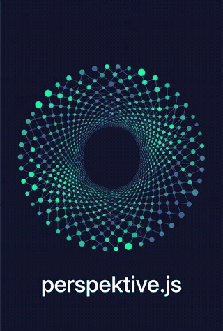

<p align="center">
  
</p>

<h1 align="center">Perspektive.js</h1>

<p align="center"><strong>A hyperbolic telescope for artificial minds.</strong></p>

<p align="center">
  <code>~16k lines</code> · <code>20+ components</code> · <code>9 graph algorithms</code> · <code>6 layout engines</code> · <code>4 WASM functions</code> · <code>2 custom GLSL shaders</code>
</p>

Unified WebGL visualization engine for [NietzscheDB](https://github.com/JoseRFJuniorLLMs/NietzscheDB) — the world's only hyperbolic vector database. Renders knowledge graphs in real non-Euclidean geometry, with mathematically exact geodesics, at 60 FPS on the GPU.

> *"Perspektive"* is the German spelling of *"perspective"*. Friedrich Nietzsche coined the concept of **Perspektivismus**: the idea that every truth depends on the observer's point of view. This library materializes that literally — the same knowledge graph can be viewed through 4 different geometric lenses, each revealing a hidden structure in the data.

---

## Why does it exist?

NietzscheDB stores AI memories in a **Poincaré ball** — not in flat Euclidean space. No existing graph library (D3, Cytoscape, Cosmograph, Sigma.js) can draw:

- **Hyperbolic geodesics** — circular arcs orthogonal to the boundary, not straight lines
- **Möbius zoom** — true Möbius automorphism `T_a(z) = (z - a) / (1 - ā·z)`, not linear pan
- **Minkowski light cones** — spacetime causality with future/past cone rendering
- **Dialectical synthesis on the Riemann sphere** — opposites at the poles, synthesis at the equator

The previous dashboard used Cosmograph and covered ~21% of NietzscheDB's feature surface. Perspektive.js covers the remaining 79% with a custom WASM-accelerated math core.

---

## The 4 Manifold Lenses

| Lens | Geometry | What it reveals |
|---|---|---|
| **Poincaré** (default) | 2D hyperbolic disk | Hierarchy: abstract concepts at center, specific memories at the edges. Includes **biological respiration** (subtle Z-axis pulse) and **crisis border pulse** (magenta glow when crisis > 0.7) |
| **Riemann** | 3D rotatable sphere | Dialectical opposites at poles, synthesis at equator (Hegelian engine). Rendered via `RiemannWireframe` with stereographic projection |
| **Minkowski** | 3D spacetime | Causality: **light cones** (future = cyan, past = magenta), timeline axis, causal edge coloring (Timelike blue / Spacelike red / Lightlike yellow), spacetime grid |
| **Emotion** | 2D Cartesian | Russell Circumplex: Valence × Arousal. Quadrant labels (ALEGRIA / RAIVA / CALMA / TRISTEZA), **density heatmap** per quadrant with additive blending |

Additionally, an **Emotion Overlay** mode can be toggled on top of Poincaré or Minkowski, applying HSL coloring based on valence/arousal values.

Switch between lenses at runtime via the **Manifold Switcher** — same data, different geometric truths.

---

## Core Capabilities

### The Cockpit (Navigation HUD)
- **Search Bar Cibernética** — real-time fuzzy search (matches id, node_type, all string fields) with shader-based **Dimming Effect** (non-matching nodes rendered at 0.3x scale)
- **Filter Panel** — interactive chips for cortex type (Episodic / Concept / DreamSnapshot / Pruned) + dual-thumb sliders for Energy / Valence / Arousal + custom predicate support (AND logic)
- **Semantic Camera** — programmatic camera API with `focusOnNode(node, duration)`, `focusOnCluster(nodes, padding, duration)`, and `followTrace(nodes, stepDuration)` for cinematic navigation
- **SDF Labels** — high-performance 3D text using Signed Distance Fields via troika-three-text, rendered only for top 20% nodes by energy or search matches
- **Tooltip on Hover** — displays node_type, id, energy, valence/arousal on mouseover
- **Streaming Status** — HUD indicator showing SSE / WebSocket / polling mode with connection state
- **TDA Stats** — Betti numbers (β₀, β₁) displayed in top-left HUD for real-time topological analysis

### AGI Visualization (Introspection Layer)
- **Schrödinger Edges** — custom `SchrodingerEdgeMaterial` (GLSL shader) with probabilistic flickering: fragments are discarded based on `probability` uniform + Perlin noise, modulated by `sin(time * 10.0)`. Additive blending creates edge glow
- **Kinetic Heat Flow** — `KineticFlowEngine` propagates 5,000 magenta particles along hyperbolic geodesics, energy-weighted (activation × 0.5 scale). Chebyshev diffusion visualization
- **Diffusion Heatmap** — 64×64 grid density map with Gaussian blur (3×3 box filter), cyan-to-magenta gradient, GPU-bound DataTexture with additive blending
- **Energy Pulse** — dual staggered rings per elite node (energy > 0.8), time-based expansion + fade over 0.4s, phase offset by node index
- **Daemon Renderer** — 3 daemon types (`entropy` red / `evolution` orange / `patrol` orange), octahedron crystalline geometry ("Will to Power" symbol), dynamic rotation (X/Y += 0.05/frame), breathing scale `1.0 + sin(t × 0.005) × 0.2`, point light per daemon, energy-modulated size
- **Reasoning Trace** — visual path tracking of multi-hop queries with dual-line rendering through the graph
- **Minkowski Light Cones** — rendered for elite nodes (energy > 0.75) with double-sided cone meshes (future cyan + past magenta), tone mapping disabled for raw glow

### Node Coloring System
Color-coded by node type:
| Type | Color |
|---|---|
| Pruned | Gray |
| Episodic | Cyan |
| Concept | Amber |
| DreamSnapshot | Violet |
| Semantic | Green |
| **Übermensch** (energy > 0.8) | **Magenta** (4x brightness multiplier) |

### Interaction System
- **Drag & Drop** — multi-node drag (selected nodes move together), OrbitControls auto-disable during drag, Poincaré boundary clamping (‖pos‖ < 0.99), callbacks: `onDragStart`, `onDragEnd`, `onDragMove`
- **Selection** — click, multi-select via `useSelection` Zustand store (`selectNode`, `toggleNode`, `selectAll`, `deselectAll`, `hideNodes`), magenta selection rings, cyan hover highlight
- **Box Select** — mouse drag rectangle with semi-transparent blue overlay (`BoxSelectOverlay`), viewport-relative coordinates
- **Context Menu** — right-click contextual actions: Focus, Expand Neighbors, Toggle Pin, Hide. Supports separators and custom items
- **Möbius Zoom** — true Möbius automorphism `T_a(z) = (z - a) / (1 - ā·z)` with complex arithmetic (`cmul`, `cdiv`), center tracking, disk clamping (‖center‖ < 0.97), batch `projectAll()` for all nodes
- **Situational Modulator** — `useSituationalModulator` hook subscribes to WebSocket "situation" control messages from NietzscheDB's agency engine. Tracks crisis level [0, 1], modulates conformal scale (1.0→2.5), auto-zooms to crisis focus coordinates, exponential decay after 2s silence, smooth interpolation (α = 0.08). PoincareView responds with bloom scaling (1.5→4.0) and magenta border pulse

### Graph Algorithms (2,061 lines)
Built-in algorithms that run directly on the hyperbolic graph:

**Centrality** (487 lines):
- `degreeCentrality` — O(V), normalized by (n-1)
- `pageRank` — power iteration with configurable damping factor
- `betweennessCentrality` — Brandes' algorithm, O(V·E)
- `closenessCentrality` — BFS/Dijkstra-based, O(V²)
- `eigenvectorCentrality` — power iteration with tunable convergence

**Pathfinding** (482 lines):
- `dijkstra` / `dijkstraPath` — single-source shortest path with `MinHeap`
- `aStar` — informed search with pluggable heuristics:
  - `euclideanHeuristic` — flat-space fallback
  - `hyperbolicHeuristic` — uses **Poincaré distance** for geometrically-aware pathfinding
- `shortestPathBFS` — unweighted shortest path

**Community Detection** (395 lines):
- `louvainCommunity` — modularity maximization (greedy)
- `labelPropagation` — label propagation algorithm

**Traversal** (378 lines):
- `bfs` — breadth-first with distance tracking
- `dfs` — depth-first with discovery/finish times
- `connectedComponents` — union-find based
- `isConnected` — boolean connectivity check

**Topological Data Analysis** (TDA):
- `computeBetti0` — connected components via union-find with path compression, O(V+E)
- `computeBetti1` — cycles via Euler characteristic: β₁ = E - V + β₀, O(1)

### Layouts
Six pluggable layout engines (+ custom registration via `registerLayout`):
- **Force-directed** — Fruchterman-Reingold with spring forces, repulsion, and cooling schedule
- **Radial** — concentric rings by depth from root with subtree-proportional spacing
- **Tree** — Reingold-Tilford hierarchical layout (LR / RL / TB / BT orientation)
- **Grid** — regular grid placement with sorting by node property
- **Concentric** — layered rings grouped by category/attribute
- **WebGPU** — `WebGPULayoutRunner` with GPU compute shader pipeline: positions/velocities in Float32Array buffers, tunable viscosity / repulsion / gravity / center attraction. 60 FPS on large graphs

### Export
- **PNG / JPEG** — canvas capture with configurable pixel ratio (1x, 2x, 4K), background color, temporary renderer resize for high-DPI
- **SVG** — vector export with node circles, edge paths, and text labels
- **JSON** — serialization + `importFromJSON()` round-trip deserialization
- **GraphML** — interoperable XML graph format via `generateGraphMLString()`
- **CSV (Clipboard)** — `graphToCSVString()` for spreadsheet import

### Theming
- Built-in presets (cyberpunk, dark, light variants) with `PerspektiveThemeProvider`
- Full customization via `PerspektiveTheme` type (colors: primary, secondary, background, etc.)
- Dynamic theme switching at runtime via `useTheme` / `useThemeValue` hooks
- CSS-in-JS generation with dynamic class injection (`theme/stylesheet.ts`)
- Runtime theme switcher UI in HUD

### Accessibility
- `describeNode(node, edges)` — textual description for screen readers
- `nodeLabel(node)` — accessible label string
- `describeEdge(edge)` — edge description
- `describeGraph(nodes, edges)` — full graph summary
- `describeManifold(type)` — manifold explanation text
- ARIA-compatible output via `a11y/descriptions` module

---

## Streaming Architecture

Real-time data pipeline for live graph updates:

| Component | Role |
|---|---|
| `WebSocketClient` | Auto-reconnect with exponential backoff, control message dispatch (RELOAD_GRAPH, HEARTBEAT, situation) |
| `GraphStore` | High-performance mutable store with `applyDelta(delta)` O(delta_size), monotonic versioning, dirty tracking, React `useSyncExternalStore` integration |
| `BinaryDecoder` | FlatBuffers schema decoder with Zstandard decompression |
| `SpatialIndex` | 32×32 fixed grid (1024 cells) for O(1) viewport culling: `insert`, `remove`, `move`, `query(ViewportBounds)` |
| `useWebSocket` | React hook for mutable WebSocket ref management with status callbacks |

**Wire format types:** `NodePayload`, `EdgePayload`, `NodeDelta` (born/died/changed ops), `GraphDelta` (seq + timestamp), `SituationMessage` (crisis level + focus coords), `StreamStats` (deltasPerSecond, latency), `LODLevel` (CLUSTER/LOW/MEDIUM/HIGH), `NodeCluster` (merged nodes for CLUSTER LOD)

---

## WASM Math Core (Rust)

Compiled from `wasm/src/lib.rs` via wasm-bindgen:

| Function | Description |
|---|---|
| `poincare_distance(p1, p2)` | Exact hyperbolic distance using `acosh` |
| `calculate_geodesic(p1, p2)` | Geodesic arc center via Cramer's rule (orthogonal circles) |
| `stereographic_project(p)` | Riemann sphere stereographic projection |
| `conformal_factor(p)` | `2.0 / (1 - ‖p‖²)` for metric scaling |

TypeScript bridge: `math/wasm-bridge.ts` with `initWasm()`, `getWasmStereographic()`, `isWasmReady()`.

Additional TypeScript math modules:
- `math/poincare.ts` — `calculateGeodesic()`, `getVisualRadius()`, conformal scaling
- `math/klein.ts` — Poincaré ↔ Klein model conversions
- `math/riemann.ts` — stereographic projection and sphere math

---

## Custom GLSL Shaders

| Shader | File | Purpose |
|---|---|---|
| `GeodesicEdgeShader` | `shaders/GeodesicEdgeShader.glsl` | Renders hyperbolic geodesic arcs as circular arcs orthogonal to the Poincaré disk boundary |
| `WillToPowerKernel` | `shaders/WillToPowerKernel.glsl` | Force-directed layout compute kernel for GPU-accelerated node positioning |
| `SchrodingerEdgeMaterial` | `materials/SchrodingerEdgeMaterial.ts` | Probabilistic edge flickering via inline GLSL: noise + time modulation + fragment discard |

---

## Tech Stack

| Layer | Technology |
|---|---|
| **Math Core** | Rust → **WASM** (exact hyperbolic geodesics, Möbius transforms, Klein model, conformal factor) |
| **Render** | **Three.js** + **React Three Fiber** + InstancedMesh (100k+ nodes, single draw call) |
| **Shaders** | Custom **GLSL** (`GeodesicEdgeShader`, `WillToPowerKernel`, `SchrodingerEdgeMaterial`) |
| **GPU Compute** | **WebGPU** compute shader pipeline for force-directed layout |
| **Streaming** | Binary WebSocket + **FlatBuffers** schema + Zstandard compression |
| **State** | **Zustand** reactive stores (graph, selection, filter, box select) + `SpatialIndex` for O(1) viewport culling |
| **Data Fetching** | **TanStack React Query** with 5s auto-refetch |
| **Post-processing** | **@react-three/postprocessing** bloom (intensity modulated by manifold + energy + crisis level) |
| **Build** | **Vite** + vite-plugin-wasm + top-level-await |
| **Testing** | **Vitest** + React Testing Library + jsdom (tests for: centrality, pathfinding, TDA, klein, poincare, MobiusZoom, GraphStore) |

---

## Project Structure

```
perspektive.js/
├── src/
│   ├── a11y/              # Accessibility (describeNode, describeGraph, describeManifold)
│   ├── agents/            # DaemonRenderer (3 types, octahedron geometry, point lights)
│   ├── algorithms/        # 9 algorithms: centrality, pathfinding, community, traversal (2,061 lines)
│   ├── analysis/          # TDA: Betti numbers β₀, β₁ via union-find + Euler characteristic
│   ├── components/        # PerspektiveEngine, LivePoincareMap, ErrorBoundary
│   │   └── overlays/      # DiffusionHeatmap, EnergyPulse, ExportToolbar
│   ├── core/              # Engine core, ManifoldContext
│   ├── edges/             # QuantumEdgeEngine, ArrowHead, curves
│   ├── engine/            # KineticFlowEngine (5,000 particles on geodesics)
│   ├── export/            # PNG, JPEG, SVG, JSON, GraphML, CSV clipboard
│   ├── interaction/       # Drag, selection, box select, context menu, Möbius zoom,
│   │                      #   SemanticCamera, SituationalModulator
│   ├── layouts/           # Force, radial, tree, grid, concentric
│   │   └── webgpu/        # WebGPULayoutRunner (GPU compute shader pipeline)
│   ├── manifolds/         # PoincareView, MinkowskiView, EmotionView
│   ├── materials/         # SchrodingerEdgeMaterial (GLSL probabilistic edges)
│   ├── math/              # Poincaré, Klein, Riemann math + WASM bridge
│   ├── search/            # SearchBar, FilterPanel, NodeLabels, useFilter
│   ├── shaders/           # GeodesicEdgeShader.glsl, WillToPowerKernel.glsl
│   ├── streaming/         # WebSocketClient, BinaryDecoder, GraphStore, SpatialIndex
│   ├── theme/             # ThemeContext, presets, stylesheet, runtime switcher
│   ├── wasm-pkg/          # Compiled WASM package
│   └── index.ts           # 100+ public API exports
├── wasm/                  # Rust source (4 WASM functions via wasm-bindgen)
│   ├── src/lib.rs
│   ├── Cargo.toml
│   └── Cargo.lock
├── docs/                  # Documentation
├── package.json
├── tsconfig.json
├── vite.config.ts
└── vitest.config.ts
```

---

## Installation

```bash
npm install @nietzsche/perspektive
```

Or run locally:

```bash
git clone https://github.com/JoseRFJuniorLLMs/perspektive.js.git
cd perspektive.js
npm install
npm run dev
```

---

## Quick Start

```tsx
import { PerspektiveEngine } from '@nietzsche/perspektive';

function App() {
  return (
    <PerspektiveEngine
      collection="eva_core"
      apiBase="http://localhost:8080"
      streamingMode="ws"
      wsUrl="ws://localhost:8080/stream"
      enableMobiusZoom={true}
      contextMenuItems={[
        { label: 'Focus', action: 'focus' },
        { label: 'Expand Neighbors', action: 'expand' },
        { label: 'Pin', action: 'pin' },
      ]}
    />
  );
}
```

### Live Data Connection

```tsx
import { LivePoincareMap } from '@nietzsche/perspektive';

// Auto-refetch every 5s via TanStack React Query
// N-dimensional → 2D projection preserving hyperbolic depth
function Dashboard() {
  return (
    <LivePoincareMap
      collection="eva_core"
      apiBase="http://localhost:8080"
      wsUrl="ws://localhost:8080/stream"
    />
  );
}
```

### Using Individual Modules

```tsx
// Manifold views
import { PoincareView, EmotionView, MinkowskiView } from '@nietzsche/perspektive';

// Streaming
import { GraphStore, WebSocketClient, SpatialIndex, BinaryDecoder } from '@nietzsche/perspektive';

// Export
import { exportToPNG, exportToSVG, exportToJSON, exportToGraphML } from '@nietzsche/perspektive';

// Math
import * as poincare from '@nietzsche/perspektive';
import * as klein from '@nietzsche/perspektive';
import * as riemann from '@nietzsche/perspektive';

// Algorithms
import { degreeCentrality, pageRank, betweennessCentrality } from '@nietzsche/perspektive';
import { dijkstra, aStar } from '@nietzsche/perspektive';
import { louvainCommunity, labelPropagation } from '@nietzsche/perspektive';
import { bfs, dfs, connectedComponents } from '@nietzsche/perspektive';
import { computeBetti0, computeBetti1 } from '@nietzsche/perspektive';

// Interaction
import { useDrag, useSelection, useBoxSelect, MobiusZoom } from '@nietzsche/perspektive';

// Theme
import { PerspektiveThemeProvider, useTheme, ThemePresets } from '@nietzsche/perspektive';

// Accessibility
import { describeNode, describeGraph, describeManifold } from '@nietzsche/perspektive';
```

---

## Scripts

| Command | Description |
|---|---|
| `npm run dev` | Start Vite dev server |
| `npm run build` | TypeScript + Vite production build |
| `npm run preview` | Preview production build |
| `npm run test` | Run tests (Vitest) |
| `npm run test:watch` | Run tests in watch mode |
| `npm run test:coverage` | Run tests with coverage |
| `npm run lint` | Lint source with ESLint |
| `npm run typecheck` | Type-check without emitting |

---

## Requirements

- **React** >= 18.0.0
- **Node.js** >= 18
- Browser with **WebGL 2.0** support (WebGPU optional, for GPU layouts)

---

## License

MIT — Built for [NietzscheDB](https://github.com/JoseRFJuniorLLMs/NietzscheDB) by [Jose R F Junior](https://github.com/JoseRFJuniorLLMs).
